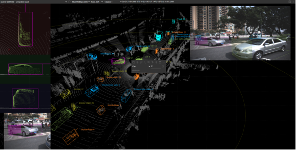
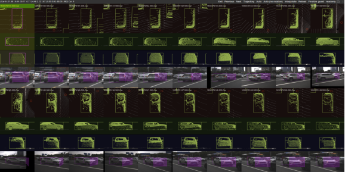
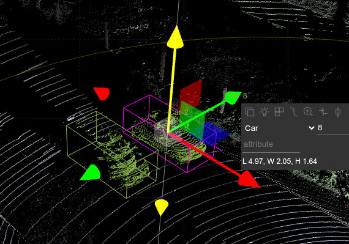
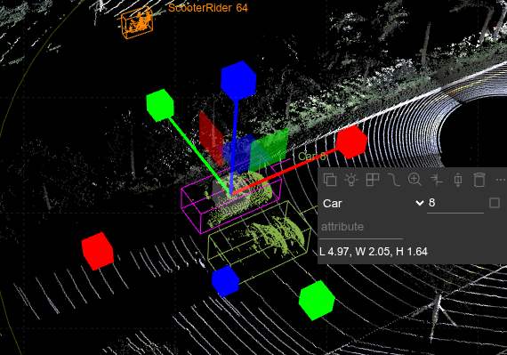
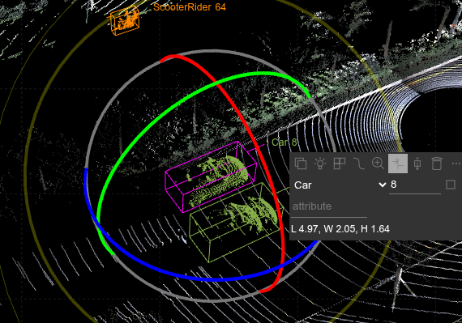
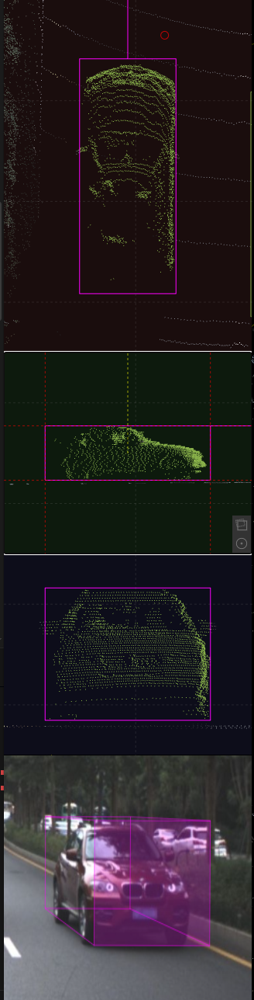
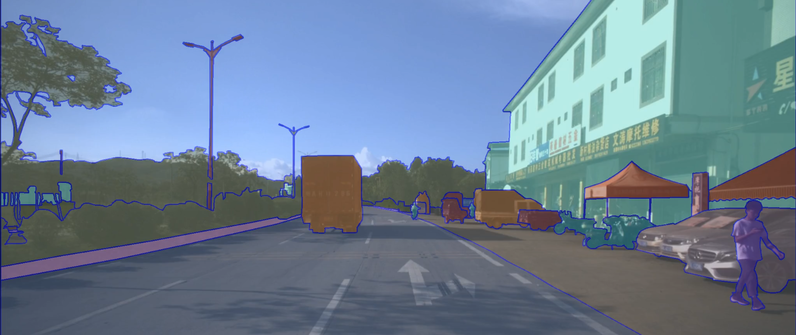
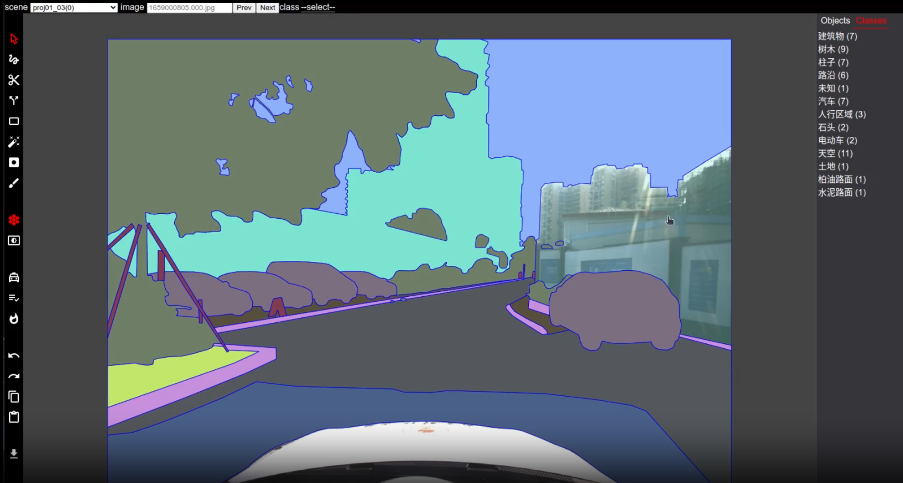
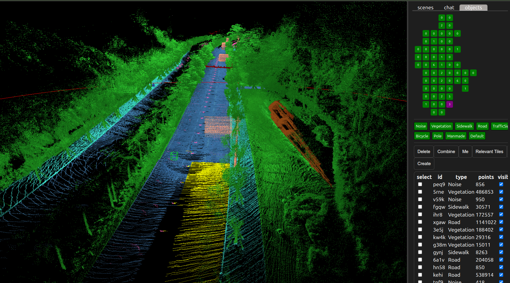

# 自动驾驶数据集标注工具

> 🎯 **模块目标**：掌握自动驾驶数据集标注工具的特性和用法

## 简介

## SUSTechPOINTS - 3D目标检测及追踪标注工具

SUSTechPOINTS是面向自动驾驶的3D点云目标检测及追踪标注平台，支持如下功能

- 3D点云/2D图像目标融合标注
- 9自由度3D Box编辑
- 交互式半自动标注
- 多帧批量编辑
- 多帧自动标注
- 多相机图片自动切换
- 错误检查
- 点云上色
- 基于web架构，支持多用户跨地域同时标注
- 用户及权限控制
- 开源

使用方法参考 

[主界面说明](https://github.com/naurril/SUSTechPOINTS/blob/fusion/README_cn.md)

[标注方法](https://github.com/naurril/SUSTechPOINTS/blob/fusion/README_guide.md)

[快捷键](https://github.com/naurril/SUSTechPOINTS/blob/fusion/doc/shortcuts_cn.md)

操作体验(校内访问): https://172.18.35.208:18082
> 默认登录guest账号，登录后选择scene/frame即可开始浏览
(guest账号没有保存权限)

### 整体架构

- 整体系统采用服务器-浏览器架构。

- 服务器端负责信息获取，用户管理等常用功能，并提供api接口支持自动标注算法运行。服务端采用cherrypy库实现webserver，通过tensorflow运行标注算法。 标注算法支持根据点云推理目标物体的旋转方向，前端利用该算法结果提供更多的交互式/启发式标注功能。

- 客户端负责除自动标注算法之外的所有操作和渲染。3D渲染部分采用three.js库。2D部分使用svg功能，部分算法依赖tfjs库，部分UI依赖react，基本无其他依赖。前端使用npm编译和发布。

### 关键技术和算法

#### 渲染

- 点云直接使用threejs的points方法进行渲染，可以修改点的大小和颜色

- 主界面包含4个camera渲染区域（3个子视图窗口和一个主视图窗口）。主视角窗口的相机使用perspective投影方式，确保效果与人眼观察世界一致。子视角采用orthogonal投影方法，确保编辑的精确性。

- 主界面点云的拖拽/移动操作使用[OribitControl](https://threejs.org/docs/?q=orbit#examples/en/controls/OrbitControls)

- 相机图片通过canva方式渲染到对应的html元素中

#### 3D空间编辑功能

选中目标，激活3D标注后，会出现3D标注控件，可分别操作每个轴的大小，旋转，位置。 该控件为threejs原生，参考[说明](https://threejs.org/docs/?q=transf#examples/en/controls/TransformControls)和[示例](https://threejs.org/examples/#misc_controls_transform)

下图分别显示位置/大小/旋转的编辑

#### 2D空间编辑功能实现

该功能通过对目标物体的多个透视图操作，完成精确的3Dbox编辑。 如下图中3个子视图上均可以实现对相应轴的操作（大小/旋转/位置）。

实现方法：对应的编辑空间后方为3D渲染区域(threejs)，表层为透明的2D编辑界面(SVG，途中虚线即为可拖拽对象)。在2D界面操作后根据投影关系计算3D框的变换，让操作者感觉和直接操作3D框效果一样。类似于在窗户玻璃上进行拖拽操作，实现对屋子里的物体的变换。

#### 批处理界面渲染

批处理编辑界面和主界面上的子视图编辑原理一致，只是批处理一次显示了多个对象的编辑界面。并增加了一些针对多个对象的编辑功能，如选中/删除/同步等。

#### 自动标注算法

各种自动/辅助标注算法，如果涉及到目标对象的旋转，均会使用[deepannotate](https://github.com/naurril/DeepAnnotate)算法，部署在webserver端，通过api访问。

其原理是根据一片给定的3D点云，计算该物体的旋转（重点是正前方）角度。算法使用[PointNet](https://arxiv.org/abs/1612.00593)骨干网络和分类头（120个分类，每个类别表示3度的区间）实现。推理时借助TTA方法(test time augmentation)进行结果融合：通过将输入点云随机旋转变成多份数据，最后使用输出平均值作为最后结果。

为减轻地面对结果的影响，输入点云最低30cm的部分需删除。

下图展示自动标注的使用
1. 用户选择一片点云（部分或全部）
1. 前端根据用户的框选经过自动扩展算法，将物体所有的点云找齐，发送给服务端(去除地面部分)
1. 服务端使用本节算法计算旋转角度,返回给前端
1. 前端根据旋转角度确定物体的大小和位置（每个轴的最大最小值及中间值）
1. 前端汇出对应的3D box，各子视图自动更新

#### 多帧自动标注算法

#### 加载速度优化

#### 点云染色

#### 2D框生成

#### 目标物体朝向优化

#### Webgl画布与批处理编辑

## 图片分割标注工具

**简介**

语义分割将图像中每个像素分配到不同的语义类别中，实现对图像内容的精细划分，分割能够有效地捕捉图像中物体的形状和边缘信息，为后续下游应有提供基础。下图为分割标注效果图。

语义分割工具的关键功能为多边形的操作和计算，包括绘制/修改/合并/intersection，对象的管理，类别编辑等。

## 点云分割标注工具

点云分割与图片类似，但是需要在3D空间操作。

## 🔗 相关资源

https://github.com/naurril/SUSTechPOINTS

## 🔗 导航链接

- [返回主页](../index.html)
- [上一模块：SUScape数据集介绍](suscape-dataset.html)
- [下一模块：数据分析](data-analysis.html)
