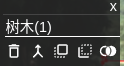

# 基本功能
  - 场景,图片选择, 前后帧切换
  - 多边形切换, 按类别/id选择
  - 绘制及编辑多边形
  - 错误检查
  - 轮廓/掩码模式查看
  - 自动保存


# 数据准备

按如下格式将图片放入程序根目录之下. 标注的数据存放在label目录之下.

````
+-data
    +-scene0001
       +- image
       +- label
    +-scene0002
       +- ...
````

# 标注方法

- 选择场景，选择图片
- 使用多边形工具画多边形，调整类别，轮廓
- 整张图全部由多边形覆盖完全则标注完成

# UI


- 顶部: 场景及图片选择
- 左边: 工具栏
- 右边: 目标导览
- 中间: 操作区域

# 操作模式及工具介绍

点模式图标切换操作模式，也可使用快捷键切换 (鼠标悬停在工具按钮上,弹出提示框中对应的字母为快捷键).


## pointer
选择多边形，可移动／删除／增加顶点.

按住shift可以选择多个多边形, 也可以使用划线的方式选择多个多边形.

## cut
通过画线的方式修改多边形，从多边形上开始，到同一个多边形结束．
如果有选中的多边形，优先编辑该多边形．
点击多边形内部可选择多边形．

## split
操作与cut相同，但是将多边形分成两个，而不是去掉其中一部分．

## polygon
画多边形．
esc键取消刚画的点
如果上两个点在其他多边形的轮廓上，Ｆ键可以跟着轮廓划线，多次Ｆ可以在不同的路径上切换．

新顶点和第一个顶点重叠完成绘制, Ｅ或者Enter完成绘制．

## rectangle
画矩形

## magic tool
点击某区域，根据颜色选择区域块．
Ｅ或者Enter完成绘制．

## fill hole
如果点击处是一个空洞（四周有其他多边形包围），则填充空洞．
Ｅ或者Enter完成绘制．

## fill class
将点击的多边形的类别修改为某选中的类别．在其他模式下修改某个多边形的类别后，对应的类别即变成当前激活的类别（记为Ａ）．然后使用本工具点击多边形，会将多边形的类别修改为Ａ．本工具用于连续修改多个多边形的类别为同一种新类别．


# 工具

## 切换 mask/outline
切换轮廓模式和掩码模式．

## 调整图片亮度
修改图片亮度．

## 添加 ego-car
添加自车的轮廓．如果已经有则不会重复添加．

## 检查错误
检查当前帧,或者场景内所有帧, 可检查空洞,层次不正确等简单问题.
检查结果点击可跳到相应的帧,或选择对应的多边形.


## 检查空洞
黑白显示,白色为空洞部分


## 浮动工具栏

选择多边形后会自动弹出浮动工具框，工具栏也有对应的工具

  

  上图中按钮功能依次为: 删除,合并,上移,下移,删除重叠部分

- 修改类别

  点击当前类别可以选择修改类别. 所有选中的多边形都会被修改.

  


- 删除(d)
  - 删除所有选中的多边形
- 多边形合并(m)
  - 选择2个多边形,合并为一个多边形
- 上下层调整（对应多变形的覆盖关系）(up/down)

  
- 删除重叠部分(x)
  - 如果选择一个多边形, 则删除该多边形被其他多边形遮挡的部分
  - 如果选择多个多边形, 则删除第一个选择的多边形被其他选择的多边形遮挡的部分
 
# 对象列表

可按类别,或者按目标对多边形进行点击选择. 按shift支持多选.


# 快捷键列表

- q 多边形模式
- g pointer模式
  
- del/d 删除
- f follow功能
- z 切换轮廓/掩码显示
- s split模式
- c cut模式
- a magic wand模式
- h fill hole模式
- esc 关闭浮动工具栏/取消选择/取消上一个顶点
- ctrl+z undo
- ctrl+y redo

- 3 上一张图
- 4 下一张图
- 1/Up 上一个多边形
- 2/Down 下一个多边形

# 标注格式说明

```
{
  "image": "1657531200.000.jpg",   //图片名
  "objects": [   //多边形, 上层的多边形放在后面
    {
      "label": "sky",  //类别
      "polygon": [
        {
          "x": 938.278464758168,
          "y": 277.0219230423967
        },
        {
          "x": 943.36926296423,
          "y": 236.2955373938999
        },
        {
          "x": 943.36926296423,
          "y": 209.6036752038626
        },
        {
          "x": 958.0958076208024,
          "y": 203.16081191661223
        },
        {
          "x": 901.7755256565666,
          "y": 188.2985152871612
        },
        {
          "x": 898.8766405305901,
          "y": 187.53353171225066
        }
      ],
      "id": 47   //id
    },
    {
      ... //objects
    }
  ],

  "version": 110 
}
```


#目标类别配置

修改 obj_cfg.js 文件.