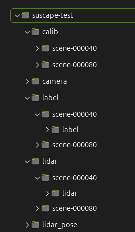
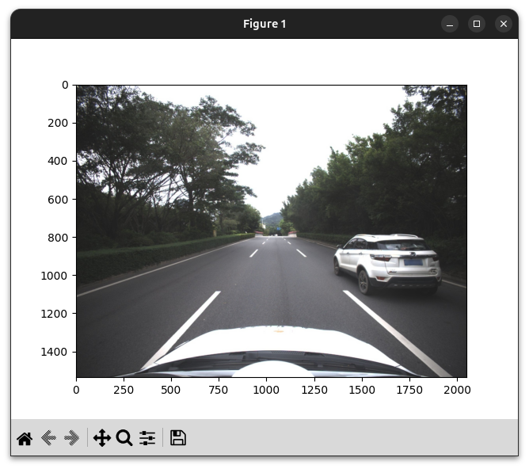
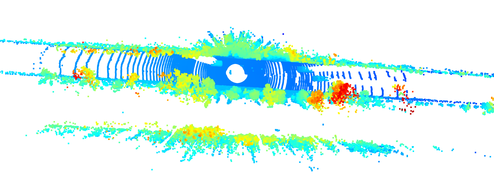
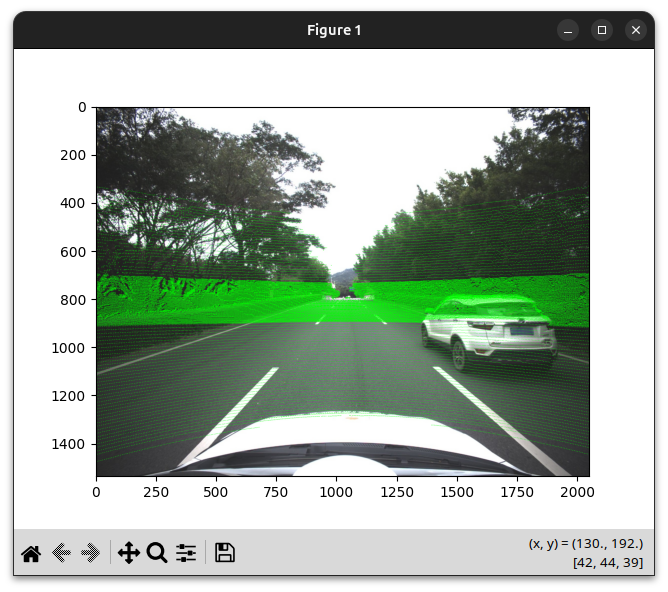
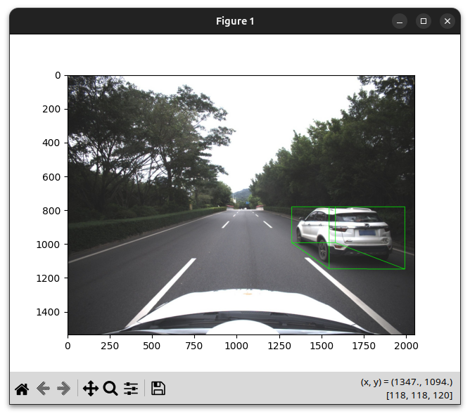

## 下载

校内下载  [http://172.18.35.208:18088](http://172.18.35.208:18088/)


仅测试可以下载v1.0-mini部分，包含2个场景。


下载后将数据解压，目录结构如下(v1.0-mini示例)



## 数据格式说明

数据集以20s长度的场景为单位存储，每个场景为一个文件目录，相机图片均为jpg文件，雷达文件为pcd文件，其他为文本或者json文件。所有文件可以使用标准的工具进行查看(pcd文件可以使用meshlab或者pcl_viewer查看)。

```
>$ tree suscape_scenes/scene-000100   -d 0
suscape_scenes/scene-000100
├── aux_camera    //红外相机
│   ├── front
│   ├── front_left
│   ├── front_right               
│   ├── rear
│   ├── rear_left
│   └── rear_right
├── aux_lidar   //盲区雷达
│   ├── front
│   ├── left
│   ├── rear
│   └── right
├── calib       // 内外参标定
│   ├── aux_camera
│   │   ├── front
│   │   ├── front_left
│   │   ├── front_right
│   │   ├── rear
│   │   ├── rear_left
│   │   └── rear_right
│   ├── aux_lidar -> ../../../calib_2/aux_lidar
│   ├── camera
│   │   ├── front
│   │   ├── front_left
│   │   ├── front_right
│   │   ├── rear
│   │   ├── rear_left
│   │   └── rear_right
│   └── radar -> ../../../calib_2/radar
├── camera   //可见光相机
│   ├── front
│   ├── front_left
│   ├── front_right
│   ├── rear
│   ├── rear_left
│   └── rear_right
├── ego_pose    // gps定位信息
├── label       // 3D标注信息
├── label_fusion  // 2D标注信息
│   ├── aux_camera
│   │   ├── front
│   │   ├── front_left
│   │   ├── front_right
│   │   ├── rear
│   │   ├── rear_left
│   │   └── rear_right
│   └── camera
│       ├── front
│       ├── front_left
│       ├── front_right
│       ├── rear
│       ├── rear_left
│       └── rear_right
├── lidar       //主激光雷达点云
├── lidar_pose   // 主激光雷达位姿
├── map          // 合并点云地图
└── radar        // 毫米波雷达数据
    ├── points_front
    ├── points_front_left
    ├── points_front_right
    ├── points_rear
    ├── points_rear_left
    ├── points_rear_right
    ├── tracks_front
    ├── tracks_front_left
    ├── tracks_front_right
    ├── tracks_rear
    ├── tracks_rear_left
    └── tracks_rear_right


```


> lidar_pose为主雷达在本场景内的位置信息（以第一帧为原点），

> 部分目录不包含在下载文件中


## 开发包安装
```
pip install numpy

git clone https://github.com/sustech-isus/suscape-devkit

cd suscape-devkit
pip install -e .

```

## 开发包使用测试


```
from suscape.dataset import SuscapeDataset, SuscapeScene, box3d_to_corners

# 加载数据集
dataset = SuscapeDataset('../suscape-test')  #  解压后的数据集根路径

# 获取所有场景名称
print(dataset.get_scene_names())

# ['scene-000040', 'scene-000080']


# 获取单个场景
scene = dataset.get_scene("scene-000040")

# 场景元信息
print(scene.meta['frames'])

# ['1630376256.000', '1630376256.500', '1630376257.000', '1630376257.500', '1630376258.000', '1630376258.500', '1630376259.000', '1630376259.500', '1630376260.000', '1630376260.500', '1630376261.000', '1630376261.500', '1630376262.000', '1630376262.500', '1630376263.000', '1630376263.500', '1630376264.000', '1630376264.500', '1630376265.000', '1630376265.500', '1630376266.000', '1630376266.500', '1630376267.000', '1630376267.500', '1630376268.000', '1630376268.500', '1630376269.000', '1630376269.500', '1630376270.000', '1630376270.500', '1630376271.000', '1630376271.500', '1630376272.000', '1630376272.500', '1630376273.000', '1630376273.500', '1630376274.000', '1630376274.500', '1630376275.000', '1630376275.500']


# 相机内参
print(scene.meta['calib']['camera']['front']['intrinsic'])

# [[1.21690847e+03 0.00000000e+00 1.01653683e+03]
# [0.00000000e+00 1.21466387e+03 7.82650652e+02]
# [0.00000000e+00 0.00000000e+00 1.00000000e+00]]

# 静态情况下外参
print(scene.meta['calib']['camera']['front']['lidar_to_camera'])

# [-0.9995972754330201, -0.028377578242037325, 2.0328790734103208e-19, -0.021313664532723924, -4.952819226132657e-05, 0.001744625479287915, -0.9999984769132878, -0.20924240211037473, 0.028377535020525, -0.9995957529596923, -0.0017453283658983086, -0.18780318704461596, 0, 0, 0, 1.0000000000000002]

# 加载场景标注信息
scene.load_labels()
print(scene.labels[scene.meta['frames'][0]])

# [{'obj_id': '1', 'obj_type': 'Car', 'psr': {'position': {'x': -3.2601223391454273, 'y': -8.570237520472277, 'z': -1.0579364150762558}, 'rotation': {'x': 0, 'y': 0, 'z': -1.5446163880149815}, 'scale': {'x': 4.058527599032187, 'y': 2.0426071642316415, 'z': 1.6831534802913666}}}, {'obj_id': '2', 'obj_type': 'Car', 'psr': {'position': {'x': -0.06339472392971578, 'y': 33.252556651189266, 'z': -1.4720650259405377}, 'rotation': {'x': -3.0617656623588495e-18, 'y': -4.0043271726712454e-18, 'z': -1.5795229730548686}, 'scale': {'x': 4.191451924624294, 'y': 2.03720670442349, 'z': 1.7489753849804401}}}, {'obj_id': '3', 'obj_type': 'Car', 'psr': {'position': {'x': -3.505089563571519, 'y': 25.993698945572586, 'z': -1.5136508643627167}, 'rotation': {'x': -3.2752247195382875e-18, 'y': -1.652971068543108e-18, 'z': -1.544616388014982}, 'scale': {'x': 4.410345802905138, 'y': 2.0568759614607246, 'z': 1.446869134902954}}}]


boxes = scene.get_boxes_by_frame(scene.meta['frames'][0])
print(boxes)

# 同scene.labels[scene.meta['frames'][0]]
# [{'obj_id': '1', 'obj_type': 'Car', 'psr': {'position': {'x': -3.2601223391454273, 'y': -8.570237520472277, 'z': -1.0579364150762558}, 'rotation': {'x': 0, 'y': 0, 'z': -1.5446163880149815}, 'scale': {'x': 4.058527599032187, 'y': 2.0426071642316415, 'z': 1.6831534802913666}}}, {'obj_id': '2', 'obj_type': 'Car', 'psr': {'position': {'x': -0.06339472392971578, 'y': 33.252556651189266, 'z': -1.4720650259405377}, 'rotation': {'x': -3.0617656623588495e-18, 'y': -4.0043271726712454e-18, 'z': -1.5795229730548686}, 'scale': {'x': 4.191451924624294, 'y': 2.03720670442349, 'z': 1.7489753849804401}}}, {'obj_id': '3', 'obj_type': 'Car', 'psr': {'position': {'x': -3.505089563571519, 'y': 25.993698945572586, 'z': -1.5136508643627167}, 'rotation': {'x': -3.2752247195382875e-18, 'y': -1.652971068543108e-18, 'z': -1.544616388014982}, 'scale': {'x': 4.410345802905138, 'y': 2.0568759614607246, 'z': 1.446869134902954}}}]


print(scene.get_boxes_of_obj(id="1"))

# {'1630376256.000': {'obj_id': '1', 'obj_type': 'Car', 'psr': {'position': {'x': -3.2601223391454273, 'y': -8.570237520472277, 'z': -1.0579364150762558}, 'rotation': {'x': 0, 'y': 0, 'z': -1.5446163880149815}, 'scale': {'x': 4.058527599032187, 'y': 2.0426071642316415, 'z': 1.6831534802913666}}}, '1630376256.500': {'obj_id': '1', 'obj_type': 'Car', 'psr': {'position': {'x': -3.2274721374645092, 'y': -9.430466495185737, 'z': -1.0466204285621643}, 'rotation': {'x': 0, 'y': 0, 'z': -1.5446163880149815}, 'scale': {'x': 4.058527599032187, 'y': 2.0426071642316415, 'z': 1.6831534802913666}}}, '1630376257.000': {'obj_id': '1', 'obj_type': 'Car', 'psr': {'position': {'x': -3.240548939771699, 'y': -10.359709555032161, 'z': -1.03188157081604}, 'rotation': {'x': 1.2630260378443695e-18, 'y': 8.886692652219865e-19, 'z': -1.5446163880149815}, 'scale': {'x': 4.058527599032187, 'y': 2.0426071642316415, 'z': 1.6831534802913666}}}, '1630376257.500': {'obj_id': '1', 'obj_type': 'Car', 'psr': {'position': {'x': -3.259194716634913, 'y': -11.394834725220262, 'z': -1.001207485795021}, 'rotation': {'x': 1.693297019818014e-19, 'y': -5.6139516421422875e-18, 'z': -1.5446163880149806}, 'scale': {'x': 4.058527599032187, 'y': 2.0426071642316415, 'z': 1.6831534802913666}}}, '1630376258.000': {'


print(scene.find_box_in_frame(frame=scene.meta['frames'][0], id="1"))

# {'obj_id': '1', 'obj_type': 'Car', 'psr': {'position': {'x': -3.2601223391454273, 'y': -8.570237520472277, 'z': -1.0579364150762558}, 'rotation': {'x': 0, 'y': 0, 'z': -1.5446163880149815}, 'scale': {'x': 4.058527599032187, 'y': 2.0426071642316415, 'z': 1.6831534802913666}}}


# 获取内外参数(动态情况下)
calib = scene.get_calib_for_frame("camera", "front", scene.meta['frames'][0])
lidar2cam, intrinsic = calib[0], calib[1]
print("lidar2cam:", lidar2cam)
print("intrinsic:", intrinsic)

# lidar2cam: [[-9.99594664e-01 -2.84650212e-02  4.99442182e-04 -5.91157111e-02]
# [-5.48434997e-04  1.71337736e-03 -9.99998382e-01 -2.10946352e-01]
# [ 2.84641194e-02 -9.99593321e-01 -1.72829408e-03 -8.77596237e-01]
# [ 0.00000000e+00  0.00000000e+00  0.00000000e+00  1.00000000e+00]]
# intrinsic: [[1.21690847e+03 0.00000000e+00 1.01653683e+03]
# [0.00000000e+00 1.21466387e+03 7.82650652e+02]
# [0.00000000e+00 0.00000000e+00 1.00000000e+00]]


# 获取场景内所有3d box
print(scene.list_objs())
# [('1', 'Car'), ('2', 'Car'), ('3', 'Car'), ('4', 'Car'), ('5', 'Car'), ('6', 'Truck'), ('7', 'Car'), ('8', 'Car')]

# 读取lidar数据
print(scene.read_lidar(scene.meta['frames'][0]))
# [[ 3.5288024e+00  5.7528061e+01  8.0187988e+00  1.6078432e-01]
# [ 4.9526739e+00  3.5370701e+01  1.1786863e+00  1.9607844e-02]
# [ 4.8674364e+00  4.8082657e+01  1.4851085e+00  3.6862746e-01]
# ...
# [-3.0950889e-01  3.2724710e+00 -2.0063124e+00  1.9607844e-02]
# [-1.2123875e-01  3.1718209e+00 -2.0037391e+00  1.5686275e-02]
# [-2.9754212e-01  3.0801411e+00 -2.0074487e+00  1.5686275e-02]]


# 读取lidar pose
print(scene.read_lidar_pose(scene.meta['frames'][0]))
# {'lidarPose': [1.0, 0.0, 0.0, 0.0, 0.0, 1.0, 0.0, 0.0, 0.0, 0.0, 1.0, 0.0, 0.0, 0.0, 0.0, 1.0]}

scene.load_lidar_pose()
print(scene.lidar_pose[scene.meta['frames'][1]])
# {'lidarPose': [0.9999984982512632, -0.0015867946343947083, 0.0006968342911850898, 0.034574549999442206, 0.001589032967337478, 0.999993542228687, -0.003223425998839192, -6.918791192384815, -0.0006917148761092656, 0.0032245284507247144, 0.9999945619586238, 0.07412946149982547, 0.0, 0.0, 0.0, 1.0]}

# 3d box转为8个顶点坐标
print(box3d_to_corners(boxes[1]))
# [[ 0.93688142 31.14802161 -2.34655272]
# [-1.10024772 31.16579937 -2.34655272]
# [-1.10024772 31.16579937 -0.59757733]
# [ 0.93688142 31.14802161 -0.59757733]
# [ 0.97345827 35.33931394 -2.34655272]
# [-1.06367086 35.35709169 -2.34655272]
# [-1.06367086 35.35709169 -0.59757733]
# [ 0.97345827 35.33931394 -0.59757733]]


# 读取图片
# pip install opencv-python matplotlib
import matplotlib.pyplot as plt
import cv2

imgpath = scene.get_image_path("camera", "front", scene.meta['frames'][0])
img = cv2.imread(imgpath)

img = cv2.cvtColor(img, cv2.COLOR_BGR2RGB)
plt.imshow(img)
plt.show()


# 读取lidar数据并显示
# show 3d lidar pts
# pip install open3d
import open3d as o3d
pts = scene.read_lidar(scene.meta['frames'][0])
pcd = o3d.geometry.PointCloud()
pcd.points = o3d.utility.Vector3dVector(pts[:,:3])
o3d.visualization.draw_geometries([pcd])


# 将lidar点投射到图片上
# project 3d points onto image
import numpy as np
frame = scene.meta['frames'][0]
pts = scene.read_lidar(frame)
image = cv2.imread(scene.get_image_path("camera", "front", frame))
image = cv2.cvtColor(image, cv2.COLOR_BGR2RGB)

calib = scene.get_calib_for_frame("camera", "front", frame)
lidar2cam, intrinsic = calib[0], calib[1]
# filter points in front of camera
pts_hom = np.hstack((pts[:,:3], np.ones((pts.shape[0],1))))
pts_cam = (lidar2cam @ pts_hom.T).T
pts_cam = pts_cam[pts_cam[:,2]>0]
# project
pts_2d = (intrinsic @ pts_cam[:,:3].T).T
pts_2d[:,0] /= pts_2d[:,2]
pts_2d[:,1] /= pts_2d[:,2]  

# filter those out of image
h, w, _ = image.shape
pts_2d = pts_2d[(pts_2d[:,0]>=0) & (pts_2d[:,0]<w) & (pts_2d[:,1]>=0) & (pts_2d[:,1]<h)]

for p in pts_2d:
    cv2.circle(image, (int(p[0]), int(p[1])), 1, (0,255,0), -1)
plt.imshow(image)
plt.show()


# 将3dbox投射到图像上
# draw 3dboxes on image
import numpy as np
frame = scene.meta['frames'][0]
boxes = scene.get_boxes_by_frame(frame)
image = cv2.imread(scene.get_image_path("camera", "front", frame))
image = cv2.cvtColor(image, cv2.COLOR_BGR2RGB)

for box in boxes:
    corners = box3d_to_corners(box)
    # project corners to image
    corners_hom = np.hstack((corners, np.ones((8,1))))
    corners_cam = (lidar2cam @ corners_hom.T).T
    corners_2d = (intrinsic @ corners_cam[:,:3].T).T

    # filter those behind camera
    corners_2d = corners_2d[corners_cam[:,2]>0]

    if corners_2d.shape[0] !=8:
        continue

    corners_2d[:,0] /= corners_2d[:,2]
    corners_2d[:,1] /= corners_2d[:,2]  
    corners = corners_2d[:, :2]
    for p in corners:
        cv2.circle(image, (int(p[0]), int(p[1])), 1, (0,255,0), -1)
    # draw lines
    for i,j in [(0,1),(1,2),(2,3),(3,0),
                (4,5),(5,6),(6,7),(7,4),
                (0,4),(1,5),(2,6),(3,7)]:

        cv2.line(image, (int(corners[i,0]), int(corners[i,1])),
                 (int(corners[j,0]), int(corners[j,1])), (0,255,0), 2)

plt.imshow(image)
plt.show()


```









参考[demo代码](https://github.com/sustech-isus/suscape-devkit/blob/main/tests/demo.py)


## 相关论文与资源

## 🔗 导航链接

- [返回主页](../index.html)
- [下一模块：标注工具介绍](points-tool.html)
- [数据分析模块](data-analysis.html)
