# SUScape数据集介绍

> 🎯 **模块目标**：了解SUScape数据集的结构、特点和应用场景

### 📊 数据集概述


[SUScape自动驾驶数据集](https://www.suscape.net) 
是一个大规模自动驾驶数据集，包含丰富的多传感器信息和完整的3D对象标注。数据集精选自深圳超过50小时的驾驶记录，覆盖1059个交通场景，涵盖多种道路类型、光照条件和天气情况。

#### 主要数据统计
- 1059个每个20秒的场景
- 42.3K次激光雷达扫描
- 254K张RGB相机图像
- 254K张红外相机图像
- 2Hz的人工标注
- 1.26M个带追踪ID的3D边界框
- 60K个对象跟踪轨迹
- 36个对象类别
- 包含雨伞、乘客、车门开启等属性
- 自车位姿/激光雷达位姿

### 数据集样例


数据样例浏览网址(校内访问): https://172.18.35.208:18082
默认登录guest账号，登录后选择scene/frame即可开始浏览
(guest账号没有保存权限)

### 数据格式说明

数据集以20s长度的场景为单位存储，每个场景为一个文件目录，相机图片均为jpg文件，雷达文件为pcd文件，其他为文本或者json文件。所有文件可以使用标准的工具进行查看(pcd文件可以使用meshlab或者pcl_viewer查看)。

```
>$ tree suscape_scenes/scene-000100   -d 0
suscape_scenes/scene-000100
├── aux_camera    //红外相机
│   ├── front
│   ├── front_left
│   ├── front_right               
│   ├── rear
│   ├── rear_left
│   └── rear_right
├── aux_lidar   //盲区雷达
│   ├── front
│   ├── left
│   ├── rear
│   └── right
├── calib       // 内外参标定
│   ├── aux_camera
│   │   ├── front
│   │   ├── front_left
│   │   ├── front_right
│   │   ├── rear
│   │   ├── rear_left
│   │   └── rear_right
│   ├── aux_lidar -> ../../../calib_2/aux_lidar
│   ├── camera
│   │   ├── front
│   │   ├── front_left
│   │   ├── front_right
│   │   ├── rear
│   │   ├── rear_left
│   │   └── rear_right
│   └── radar -> ../../../calib_2/radar
├── camera   //可见光相机
│   ├── front
│   ├── front_left
│   ├── front_right
│   ├── rear
│   ├── rear_left
│   └── rear_right
├── ego_pose    // gps定位信息
├── label       // 3D标注信息
├── label_fusion  // 2D标注信息
│   ├── aux_camera
│   │   ├── front
│   │   ├── front_left
│   │   ├── front_right
│   │   ├── rear
│   │   ├── rear_left
│   │   └── rear_right
│   └── camera
│       ├── front
│       ├── front_left
│       ├── front_right
│       ├── rear
│       ├── rear_left
│       └── rear_right
├── lidar       //主激光雷达点云
├── lidar_pose   // 主激光雷达位姿
├── map          // 合并点云地图
└── radar        // 毫米波雷达数据
    ├── points_front
    ├── points_front_left
    ├── points_front_right
    ├── points_rear
    ├── points_rear_left
    ├── points_rear_right
    ├── tracks_front
    ├── tracks_front_left
    ├── tracks_front_right
    ├── tracks_rear
    ├── tracks_rear_left
    └── tracks_rear_right


```

> lidar_pose为主雷达在本场景内的位置信息（以第一帧为原点）， 


### 硬件平台

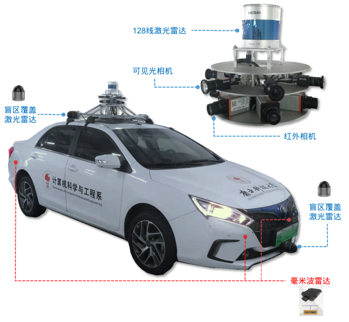

| 组件 | 数量|型号|描述 |
|---|--|--|--|
| 128线束激光雷达 | 1 |Hesai Pandar128|单个高精度激光雷达，用于获取环境深度信息 |
| 32线激光雷达 | 4|robosense BP32 |布置于车辆四周，覆盖盲区，实现360°检测 |
| 毫米波雷达 | 6|华讯方舟 HX-77M01 | 用于监测车辆周边的动态物体 |
| 高清相机 | 6|相机：FLIR, BFS-PGE-31S4C-C镜头：4mm焦距 |360°无死角捕捉环境图像 |
| 红外相机 | 6| XenicsGobi+ 640 GigE |用于低光环境下的图像采集 |
| GPS/IMU | 1| NovAtel PwrPak7D-E1 |用于提供精确定位和运动姿态数据，支持RTK |
| 时钟同步服务器 | 1| |保证多传感器数据高精度时钟同步 |
| 车载工业计算机 | 1| |高性能数据处理平台，支持传感器数据的实时整合和处理 |


> 毫米波雷达为2D毫米波雷达，根据安装高度进行平面扫描，探测目标物速度（径向速度，相对自车的速度）及位置。转化为3D坐标点时需要根据高度补充z坐标。

> 主激光雷达为128线激光雷达，安装在车顶，测量自车周围3D信息，数据包括点坐标（x，y，z）和激光反射强度（intensity）及时间戳


### 坐标系

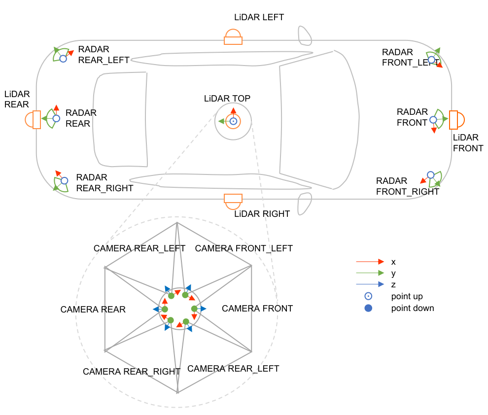

- 主雷达： x左，y后，z上

### 时间/空间同步


自动驾驶系统中，多传感器协同工作是实现高精度感知与决策的关键。对传感器进行时间同步，可以确保不同设备在同一时刻获取的数据具有一致性，避免因时间延迟而导致数据错位；而空间同步则通过校准各传感器在车辆上的安装位置和朝向，实现数据在统一坐标系下的精准对齐，便于多模态数据融合和综合分析，从而增强场景理解和环境感知的准确性。
- 所有设备时间和GPS时间同步：时间服务器通过PTP/1588协议在设备间同步时间
- GPS/IMU惯导通过GPS/RTK得到GPS定位位置，其他设备间位置信息通过外参确定。

> 外参是不同设备之间的坐标系变换关系
内参（如相机）是设备内不同的坐标系之间的关系（如图像坐标，相机坐标等）

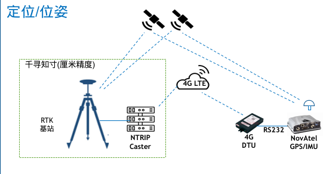

无遮挡情况下，通过GPS信号可以获得误差<1m的定位精度，叠加RTK技术，误差可以达到厘米级别。


> [RTK](https://en.wikipedia.org/wiki/Real-time_kinematic_positioning)（实时动态定位）是一种利用载波相位差分技术实现实时高精度定位的方法。基于基准站与流动站之间的差分信息，RTK能将定位误差降至厘米级，主要应用于自动驾驶、无人机导航及精密工程测量等领域，提供可靠且精准的位置校正。

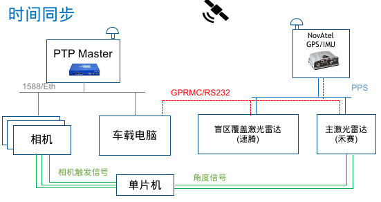

PTP Master和NovTel均同步于GPS时间。相机及车载电脑的时间与PTP Master同步（通过1588协议）， 激光雷达通过PPS信号和RS232接口与GPS/IMU设备同步时间。红外相机/毫米波雷达无系统时间，这些数据的时间戳取自车载电脑的时间。


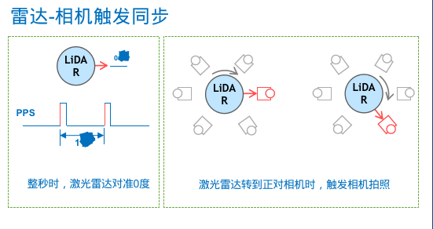


#### 相机内参标定

相机标定是指通过采集一系列标准几何图案的图像（如棋盘格或圆点阵列），来确定相机的内部参数（焦距、主点、镜头畸变等）。这种标定可以提高图像测量和三维重建的准确性，并为后续的视觉处理、目标检测、定位与追踪等任务提供关键数据支持。

标定工具参考 https://wiki.ros.org/camera_calibration

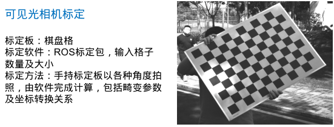


红外相机标定除了几何特性标定外，还有温度的标定，下图显示的是几何特性的标定方法，温度标定我们采用厂家数据。
红外相机标定时需要待标定物和背景有明显的温差，才能检测到几何图案轮廓。我们采用有孔的标定板，选取天空作为背景。
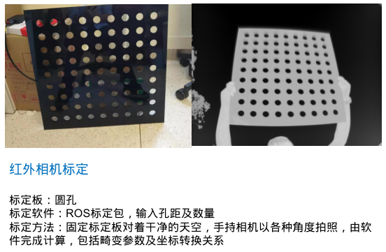


外参标定

- 激光雷达和毫米波雷达标定
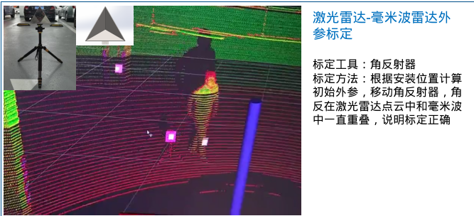


- 相机和激光雷达标定

   - 粗标

    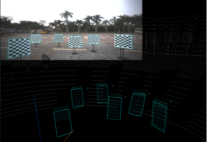

    > 通过图片和点云点的对应关系和坐标，计算（优化）外参

   - 精细调整工具（手工）
    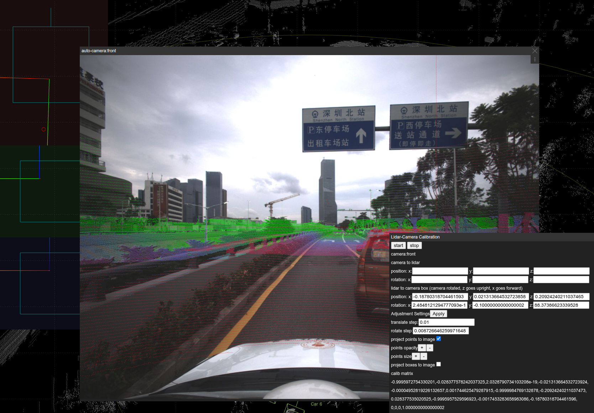
    > 该工具支持实时可视化外侧效果，通过调整相机box的位置和旋转，精细调整外参

- 惯导设备和激光雷达标定

#### 标定效果

下图为前向相机和主雷达点云标定后的显示效果

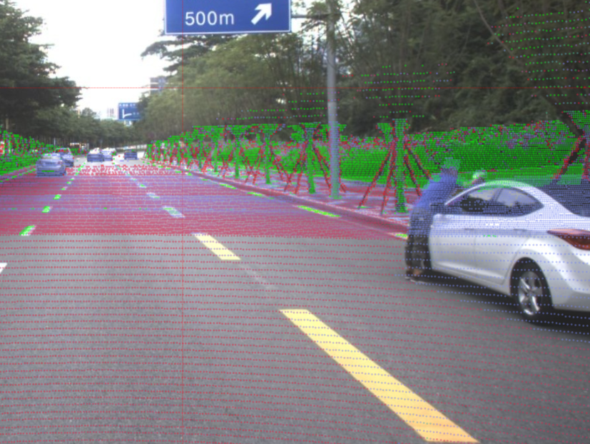


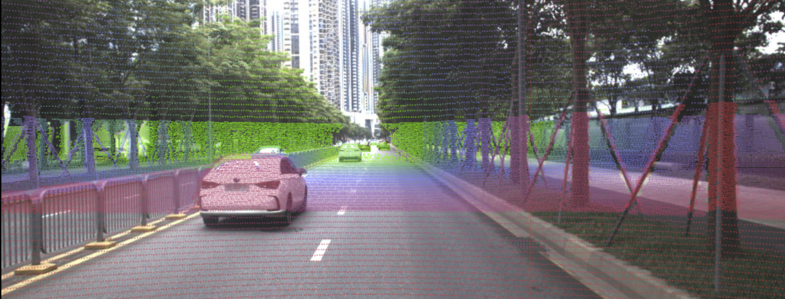


### 数据集构建过程
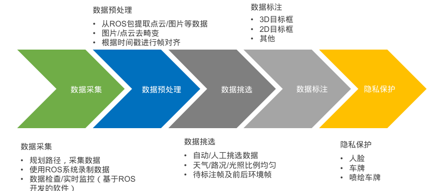

### 数据采集

本数据集的数据主要在深圳采集。

- 采集软件： 数据采集使用ROS系统，数据存储为rosbag文件格式。
> 采集软件的主要功能除获取数据并保存到硬盘外，还有监控数据是否正常，是否发生丢帧等功能。


- 采集地点

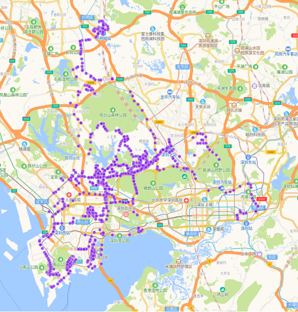

### 数据预处理

- 相机图片去畸变

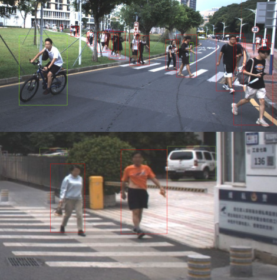

上图为红外相机去畸变效果，可见畸变的直线（标定板边沿）恢复为直线了。

- 点云去畸变(运动畸变)
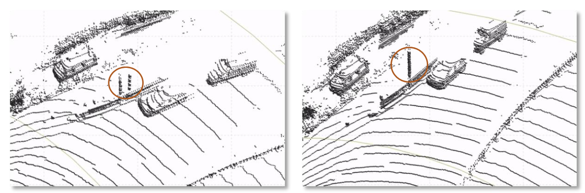

> 机械雷达产生运动畸变的原因

> 当车辆处于运动状态时，机械雷达在进行旋转扫描时，不同角度的测量数据会在不同时间采集。由于车辆在扫描过程中会发生位置和姿态的变化，导致相邻角度的数据存在时间偏差，从而产生运动畸变。这种时间差异使得数据在空间上不能完全对齐，需在后续处理中对采集数据进行时空校正以消除畸变误差。


> 去畸变原理

> 在数据去畸变过程中，我们主要通过运动畸变校正（Motion Distortion Correction）来消除因传感器采集数据时车辆运动产生的时间偏差。此方法利用车辆的即时运动信息（如GPS/IMU数据）和精确的采集时间戳，对每一个数据点进行时空校正，将其映射到一个统一的时间参考系下。

> 基本步骤包括：
> 1. 运动估计：使用车辆动态信息预测在各个采集时刻的运动轨迹（包含3D坐标和旋转）。
> 2. 重投影修正：依据运动估计结果，将每个数据点从原始采集位置校正到统一时间参考系中的准确位置，从而修正因采集延迟而引起的空间歪斜。

> 这种校正机制确保融合后数据的几何一致性，并为后续感知与决策提供高精度的基础数据。


- 数据帧对齐

无论激光雷达还是相机图片，从rosbag解包后均按时间戳命名。

数据帧对齐的目的是将不同传感器的数据对应起来，对齐之后的数据文件命名相同，后续使用时能方面的知道那些数据是同一帧的。

我们采用绝对时间对齐方法：
- 通过惯导pps硬件信号(pulse per second)，控制主激光雷达（10hz）与0.1s对齐
- 通过雷达-相机触发机制，控制相机触发时间（根据安装角度课集选对应相机的触发时间）

将雷达/相机数据对齐到最近的理想触发时间点，是为帧id.


### 数据筛选


数据集按场景组织，每个场景时长20秒。根据天气/光照情况/路况/复杂情况等综合考虑选取待标注场景。目前的数据集依靠人工筛选。

### 数据标注

目前已经完成的标注内容
- 目标3DBox（位置，大小，旋转）
- 目标ID (20s场景内唯一)
- 类别及属性
- 2DBox（通过3Dbox和点云映射生成，部分由人工修正）

具体标注方法参考下一模块介绍。

### 隐私保护

数据集的隐私保护主要防止敏感信息泄露：确保车辆、行人等可能涉及的个人身份信息（如车牌、面部特征等）得到有效保护，避免隐私被滥用。
- 人脸
- 车牌
- 喷绘车牌号码

我们通过检测算法和人工修正进行关键区域的识别，然后使用高斯filter进行模糊化处理。

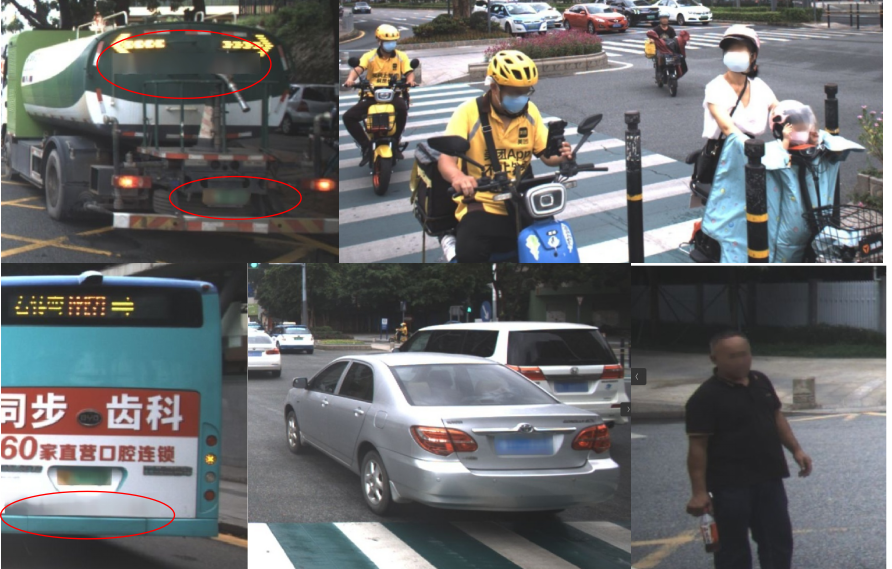

> 图上红色框内为喷绘车牌号码

### 相关论文与资源

## 🔗 导航链接

- [返回主页](../index.html)
- [下一模块：标注工具介绍](points-tool.html)
- [数据分析模块](data-analysis.html)
